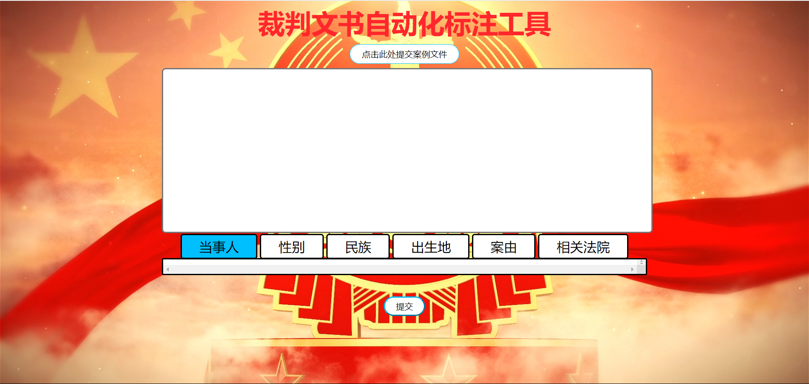

# 说明文档

## 裁判文书自动化标注工具

### 1 使用说明



- 用户有两种方式提交文本，二种任选一种即可：

  1. 点击页面上方的**点击此处提交案例文件**，可以从本地选择文件，**支持txt格式**。点击底部**提交**即可。

  2. 直接将文本复制到输入框中，点击底部**提交**即可。

  如果直接点击提交会显示**输入不能为空**


提交后会得到如下图所示的，按词性分好的多个可选项。此时用户可手动的选择导航栏上每一项所对应的标注，选择完毕后点击**保存案件与标注**可将标注结果传到后端，与文书文本一同保存在本地，分别命名为**标注.json**与**案件文本.txt**


此时我们选择导航栏上每一项所对应的标注


点击**保存案件与标注**，即可在后端看到在本地生成了两个文件**标注.json**与**案件文本.txt**，分别保存文书标注与文书的文本


### 2 代码结构

```bash
.
|  readme.assets # README文件中的截图
|
│  static # 静态文件
|	|	background.png # 背景图片
|	|	functions.js # js函数
|	|	jQuery.js
|	└─	style.css
|	
|  templates # 模板文件
|	└─	file.html
|
|  cut.py   	 # 分词程序
|  main.py  	 # flask程序，程序入口
|  README.md
|  requirements.txt  # 项目依赖关系清单
|
|  标注.json 	 	# 标注结果
└─ 案件文本.txt    # 案件文本
```

### 3 技术实现

#### 3.1 前端部分：

1. 总体概述

   前端页面使用HTML5+CSS+JS+jQuery实现，完成了读取用户输入，或是让用户选择本地文件上传并在读取文件后将其内容显示至文本框中的功能。之后将用户输入传至后端并进行分词，得到后端数据后再生成相应的多选框供用户进行选择标记。用户可通过导航栏来给每个类别选定标签。最后，用户点击保存按钮后将选定的数据传入后端进行保存。

2. 实现细节

   首先获取用户输入的文本框使用HTML的textarea标签，并且在输入为空的情况下会发出提示。与后端的数据交互使用Ajax完成。多选框使用checkbox类型的input标签，由于默认样式不够美观，故使用CSS对其进行了美化。导航栏实质为单选框，使用label标签与其绑定并同样使用CSS进行美化。导航栏的每一个选项都对应一个多选框，使用jQuery给其添加监听事件，点击哪个选项就将其对应多选框显示，同时隐藏其他多选框。最后在用户点击保存按钮后将其选择结果打包为JSON对象传至后端。

3. 改进方向

   可以使用Vue等框架优化代码结构，提高代码复用性与可扩展性；界面整体还较为粗糙，可以进一步美化；可以添加用户手动输入文本进行标注的功能，使标注不再局限于分词结果。

#### 3.2 后端部分：

1. 总体概述

   后端使用了flask框架，Flask相对于Django而言是轻量级的Web框架。但和Django不同，Flask轻巧、简洁，通过定制第三方扩展来实现具体功能。可定制性，通过扩展增加其功能，这是Flask最重要的特点。其 WSGI 工具箱采用 Werkzeug（路由模块），模板引擎则使用 Jinja2。前端用户选择好文本点击提交时，后端会从前端接收到用户选择的文本，并将分词结果传回前端供用户勾选。前端用户选择好后点击提交标注，标注结果会传回后端，后端将标注结果与案件文本保存到本地

2. 实现细节

   ```python
   @app.route("/submit", methods=['POST'])
   def submit():
   ```

   在这里，URL **'/ submit'** 规则绑定到**submit()**函数。 前端用户提交文本时，后端会调用事件处理函数**submit()**，前端数据采用POST方式提交，因此后端使用**request.form.get()**函数获取数据，即裁判文书的文本，并使用全局变量**content**保存。此时调用分词函数**cut()**，并将**content**作为参数传入函数，分词函数返回一个包含名词、动词、形容词列表的列表**content_list**。后端返回到前端是数据是json类型，其中包含用来判断返回是否成功的字符串**'message': 'success'**，以及一个包含名词、动词、形容词列表的列表**'content': content_list**，传到前端后供用户勾选。

   ```python
   @app.route("/save", methods=['POST'])
   def save():
   ```

   前端用户选择好后点击提交标注时，后端会调用**save()**函数，此时返回的标注结果为json类型，我们使用**request.form.get()**获取该数据中的每一项，即姓名、性别、民族、出生地、案由、法院对应的标注，并使用OrderedDict()保存为有序字典，使用**json.dump()**函数将字典转化为json格式，与案件文本，即变量**content**一同存储在本地。

#### 3.3 NLP部分：

1.	总体概述
   分词部分采用jieba分词+正则表达式+手动分词判断实现，完成了对裁判文书字符串的分词。Cut（content）函数实现了如下方法：content为传入的文书内容，返回三个列表，其中第一个为名词列表，包括法庭（court）、被告人（criminal）、性别（gender）、出生地（birthplace）、民族（ethnicity）、案由（accusation）等信息；第二个为动词列表，返回出现频率、重要程度高的四个动词；第三个为形容词列表，返回出现频率、重要程度高的四个形容词。
2.	实现细节
   先将传入的content转为字符串（str）类型。使用jieba分词库的jieba.analyse.extract_tags函数，将其字符串参数置为content，词语数量参数置为4，词性参数分别置为形容词和动词，以此来生成动词和形容词列表。
   名词列表的处理较为麻烦，首先按照换行符（'\n’）分割成若干部分，保存在word_List中。根据裁判文书的结构，法庭信息为word_List列表的第一个元素，至此获得court。第二步，遍历word_List，若字符串‘被告人’在某元素中，则对该元素进行处理：将其根据标点符号分隔开，判断被告人姓名长度，以此获得criminal。第三步，根据文书结构中，被告人的性别常常跟在姓名之后的特点，对第二步中的元素再次进行提取，若包含‘女’则将性别置为女，反之亦然，至此获得gender。第四步，遍历word_List，若字符串‘族’在某元素中，则对该元素进行处理：将其根据标点分隔开，再找出含有‘族’的语段，使用jieba.lcut函数，将表示民族的词分出来，至此获得ethnicity。第五步，遍历word_List，若字符串‘罪’在某元素中，仿照第四步，结合jieba分词函数获得罪名accusation。
3.	改进方向
   在对jieba分词库学习研究的过程中，我发现库内函数常常因为将整句分词过于零碎而无法达到预期标准。jieba分词分为三种模式：全模式、搜索引擎模式、paddle模式。支持不同模式背后的算法不尽相同，可以结合不同模式以达到目标要求。
   为了解决词语过于零散的问题，我略读了几十份裁判文书，寻找其中的共同点，以提取出所需的信息。代码中的循环分支、条件判断语句颇有些“面向用例编程”的特点。未来的改进方向：根据需求编写出适应于所有文本的程序，以达到提取用户需要的信息的目的。
